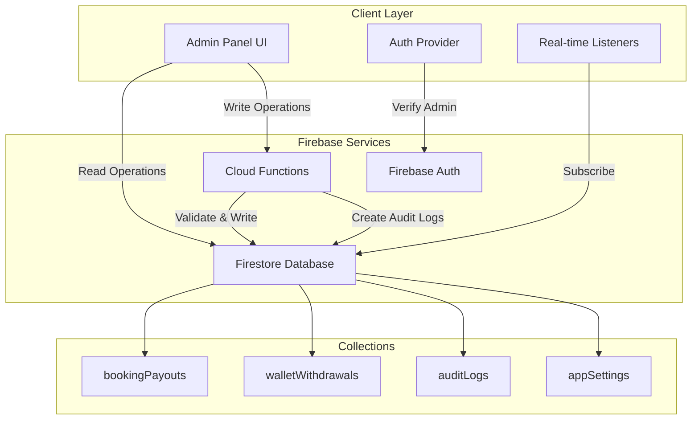

# Design Document: Admin Finance & Settings Module

## Overview

The Admin Finance & Settings Module provides secure financial management and system configuration capabilities for the HomeFix platform. This module enables administrators to manage booking payouts, approve wallet withdrawals, monitor system activities through audit logs, and configure platform-wide settings.

### Key Design Principles

1. **Security-First Architecture**: All financial write operations are processed exclusively through Firebase Cloud Functions, preventing direct database manipulation and ensuring proper authorization
2. **Real-Time Data Synchronization**: Firestore real-time listeners provide live updates across all data views
3. **Audit Trail Completeness**: Every administrative action is automatically logged with full context
4. **Responsive Design**: Mobile-first approach with adaptive layouts for all screen sizes
5. **Error Resilience**: Comprehensive error handling with user-friendly messages and retry capabilities

### Technology Stack

- **Frontend Framework**: Next.js 14 (App Router) with TypeScript and React
- **Styling**: Tailwind CSS with custom design system
- **Backend**: Firebase Firestore for data storage
- **Functions**: Firebase Cloud Functions for all write operations
- **Authentication**: Firebase Authentication with custom admin claims
- **State Management**: React hooks with real-time Firestore listeners
- **UI Components**: Custom component library with lucide-react icons

## Architecture

### System Architecture Diagram



### Security Architecture

The module implements a Firebase-first security model:

1. **Read Operations**: Direct Firestore queries with security rules enforcement
2. **Write Operations**: Exclusively through callable Cloud Functions
3. **Authentication**: Admin claims verified on every function call
4. **Audit Trail**: Automatic logging of all administrative actions
5. **Token Management**: Fresh ID tokens with admin claims passed to all functions

### Data Flow Patterns

#### Read Flow (Display Data)
```
Admin Panel → Firestore Real-time Listener → UI Update
```

#### Write Flow (Financial Operations)
```
Admin Panel → Cloud Function (with auth token) → Validation → Firestore Write → Audit Log → Success Response → UI Update
```

## Components and Interfaces

### Page Components

#### 1. Booking Payouts List Page
**Path**: `/finance/booking-payouts`
**Purpose**: Display and manage technician booking payouts

**Component Structure**:
```typescript
BookingPayoutsPage
├── PageHeader (title, actions)
├── StatsCards (total payouts, pending, completed)
├── FilterBar (status filter, search)
├── PayoutsTable
│   ├── PayoutRow (for each payout)
│   └── Pagination
└── LoadingState | ErrorState | EmptyState
```

**Key Features**:
- Paginated list (20 items per page)
- Real-time updates via Firestore listeners
- Status filtering (pending, processing, completed, failed)
- Search by technician name or booking ID
- Click to view details

#### 2. Booking Payout Details Page
**Path**: `/finance/booking-payouts/[id]`
**Purpose**: View and process individual payout

**Component Structure**:
```typescript
BookingPayoutDetailsPage
├── BackButton
├── PayoutHeader (status badge, timestamps)
├── PayoutDetails (all payout information)
├── ActionButtons
│   └── MarkAsPaidButton (conditional on status)
└── LoadingState | ErrorState
```

**Key Features**:
- Complete payout information display
- "Mark as Paid" action for pending payouts
- Real-time status updates
- Color-coded status indicators

#### 3. Wallet Withdrawals List Page
**Path**: `/finance/wallet-withdrawals`
**Purpose**: Display and manage technician withdrawal requests

**Component Structure**:
```typescript
WalletWithdrawalsPage
├── PageHeader
├── StatsCards (total requests, pending, approved)
├── FilterBar (status filter, search)
├── WithdrawalsTable
│   ├── WithdrawalRow
│   └── Pagination
└── LoadingState | ErrorState | EmptyState
```

**Key Features**:
- Paginated list (20 items per page)
- Real-time updates
- Status filtering
- Search by technician name
- Click to view details

#### 4. Wallet Withdrawal Details Page
**Path**: `/finance/wallet-withdrawals/[id]`
**Purpose**: View and process withdrawal requests

**Component Structure**:
```typescript
WalletWithdrawalDetailsPage
├── BackButton
├── WithdrawalHeader
├── WithdrawalDetails (amount, bank details, IFSC)
├── ActionButtons
│   ├── ApproveButton (with notes dialog)
│   └── RejectButton (with reason dialog)
└── LoadingState | ErrorState
```

**Key Features**:
- Complete withdrawal information
- Approve/Reject actions for pending requests
- Required rejection reason (min 10 characters)
- Optional admin notes for approval
- Real-time status updates

#### 5. Audit Logs Page
**Path**: `/audit-logs`
**Purpose**: Monitor all administrative actions

**Component Structure**:
```typescript
AuditLogsPage
├── PageHeader
├── FilterBar
│   ├── ActionTypeFilter
│   ├── EntityTypeFilter
│   └── DateRangeFilter
├── AuditLogsTable
│   ├── AuditLogRow
│   └── Pagination
└── LoadingState | ErrorState | EmptyState
```

**Key Features**:
- Paginated list (50 items per page)
- Real-time updates
- Multi-dimensional filtering
- Read-only (no edit/delete)
- Expandable metadata view

#### 6. Settings Page
**Path**: `/settings`
**Purpose**: Configure platform-wide settings

**Component Structure**:
```typescript
SettingsPage
├── PageHeader
├── SettingsForm
│   ├── CommissionField (0-100%)
│   ├── SupportPhoneField
│   ├── SupportEmailField
│   ├── MaintenanceModeToggle
│   ├── MinWithdrawalField
│   └── SaveButton
├── ValidationErrors
└── LoadingState | ErrorState
```

**Key Features**:
- Edit mode with inline validation
- Real-time settings updates
- Form state preservation on error
- Disabled state during save

### Shared Components

#### FilterBar Component
```typescript
interface FilterBarProps {
  onSearch: (term: string) => void;
  onFilterChange: (filters: Record<string, any>) => void;
  filters: FilterConfig[];
}
```

#### StatusBadge Component
```typescript
interface StatusBadgeProps {
  status: 'pending' | 'processing' | 'completed' | 'failed' | 'approved' | 'rejected';
  size?: 'sm' | 'md' | 'lg';
}
```

#### ConfirmDialog Component
```typescript
interface ConfirmDialogProps {
  title: string;
  message: string;
  confirmText: string;
  cancelText: string;
  onConfirm: () => void;
  onCancel: () => void;
  requireInput?: boolean;
  inputLabel?: string;
  inputValidation?: (value: string) => string | null;
}
```

## Data Models

### Firestore Collections

#### bookingPayouts Collection
```typescript
interface BookingPayout {
  id: string;
  bookingId: string;
  technicianId: string;
  technicianName: string;
  serviceId: string;
  serviceName: string;
  bookingAmount: number;
  platformCommissionPercentage: number;
  platformCommissionAmount: number;
  technicianEarning: number;
  status: 'pending' | 'processing' | 'completed' | 'failed';
  payoutMethod: 'bank_transfer' | 'wallet' | 'upi';
  createdAt: Timestamp;
  paidAt?: Timestamp;
  processedBy?: string; // Admin ID
  notes?: string;
}
```

**Indexes**:
- `status` (ascending) + `createdAt` (descending)
- `technicianId` (ascending) + `createdAt` (descending)

#### walletWithdrawals Collection
```typescript
interface WalletWithdrawal {
  id: string;
  technicianId: string;
  technicianName: string;
  amount: number;
  bankAccountNumber: string;
  bankAccountName: string;
  ifscCode: string;
  bankName: string;
  status: 'pending' | 'approved' | 'rejected' | 'completed';
  requestedAt: Timestamp;
  processedAt?: Timestamp;
  processedBy?: string; // Admin ID
  adminNotes?: string;
  rejectionReason?: string;
}
```

**Indexes**:
- `status` (ascending) + `requestedAt` (descending)
- `technicianId` (ascending) + `requestedAt` (descending)

#### auditLogs Collection
```typescript
interface AuditLog {
  id: string;
  adminId: string;
  adminName: string;
  adminEmail: string;
  actionType: 'payout_processed' | 'withdrawal_approved' | 'withdrawal_rejected' | 'settings_updated';
  entityType: 'booking_payout' | 'wallet_withdrawal' | 'app_settings';
  entityId: string;
  metadata: Record<string, any>;
  ipAddress: string;
  userAgent: string;
  createdAt: Timestamp;
}
```

**Indexes**:
- `actionType` (ascending) + `createdAt` (descending)
- `entityType` (ascending) + `createdAt` (descending)
- `adminId` (ascending) + `createdAt` (descending)

#### appSettings Document
**Path**: `appSettings/config`

```typescript
interface AppSettings {
  platformCommissionPercentage: number; // 0-100
  supportPhoneNumber: string;
  supportEmail: string;
  maintenanceMode: boolean;
  minWithdrawalAmount: number;
  lastUpdatedAt: Timestamp;
  lastUpdatedBy: string; // Admin ID
}
```

### Cloud Function Interfaces

#### processBookingPayout
```typescript
interface ProcessBookingPayoutRequest {
  payoutId: string;
}

interface ProcessBookingPayoutResponse {
  success: boolean;
  message: string;
  payout?: BookingPayout;
}
```

#### approveWalletWithdrawal
```typescript
interface ApproveWalletWithdrawalRequest {
  withdrawalId: string;
  adminNotes?: string;
}

interface ApproveWalletWithdrawalResponse {
  success: boolean;
  message: string;
  withdrawal?: WalletWithdrawal;
}
```

#### rejectWalletWithdrawal
```typescript
interface RejectWalletWithdrawalRequest {
  withdrawalId: string;
  rejectionReason: string; // Required, min 10 chars
}

interface RejectWalletWithdrawalResponse {
  success: boolean;
  message: string;
  withdrawal?: WalletWithdrawal;
}
```

#### updateAppSettings
```typescript
interface UpdateAppSettingsRequest {
  platformCommissionPercentage?: number;
  supportPhoneNumber?: string;
  supportEmail?: string;
  maintenanceMode?: boolean;
  minWithdrawalAmount?: number;
}

interface UpdateAppSettingsResponse {
  success: boolean;
  message: string;
  settings?: AppSettings;
}
```


## Correctness Properties

*A property is a characteristic or behavior that should hold true across all valid executions of a system—essentially, a formal statement about what the system should do. Properties serve as the bridge between human-readable specifications and machine-verifiable correctness guarantees.*

### Property Reflection

After analyzing all acceptance criteria, I identified the following testable properties. During reflection, I consolidated redundant properties:

**Consolidations Made**:
1. Combined multiple "display all required fields" properties into comprehensive rendering properties
2. Merged similar error handling properties across different operations
3. Unified validation properties for similar input types
4. Combined real-time listener properties into a single comprehensive property

### Property 1: List Ordering Consistency

*For any* collection of booking payouts, wallet withdrawals, or audit logs, when displayed in the admin panel, the items should be ordered by their creation/request date in descending order (newest first).

**Validates: Requirements 2.1, 5.1, 8.1**

### Property 2: Complete Information Display

*For any* booking payout, wallet withdrawal, or audit log entry, when rendered in the admin panel, the displayed output should contain all required fields specified for that entity type (e.g., for payouts: booking ID, technician name, amount, commission, earning, status, date).

**Validates: Requirements 2.2, 3.1, 5.2, 8.2**

### Property 3: Search Filtering Correctness

*For any* search term and collection of items (payouts or withdrawals), the filtered results should only include items where the search term appears in the searchable fields (technician name, booking ID), and all matching items should be included.

**Validates: Requirements 2.4, 5.4**

### Property 4: Conditional Action Button Visibility

*For any* booking payout with status "pending", the admin panel should display the "Mark as Paid" action button; for any wallet withdrawal with status "pending", the admin panel should display both "Approve" and "Reject" action buttons.

**Validates: Requirements 4.1, 6.1, 7.1**

### Property 5: Cloud Function Invocation with Correct Parameters

*For any* administrative action (process payout, approve withdrawal, reject withdrawal, update settings), when executed, the admin panel should invoke the corresponding Cloud Function with all required parameters including the entity ID, admin authentication token, and any action-specific data (notes, rejection reason, settings values).

**Validates: Requirements 4.2, 6.3, 7.3, 10.6**

### Property 6: Success Response Handling

*For any* Cloud Function invocation that succeeds, the admin panel should display a success message and refresh the relevant data view to reflect the updated state.

**Validates: Requirements 4.4, 6.5, 7.5, 10.8**

### Property 7: Error Response Display

*For any* Cloud Function invocation that fails, the admin panel should display the error message returned by the function to the user.

**Validates: Requirements 4.5, 6.6, 7.6, 10.9, 13.2**

### Property 8: UI Disabled State During Operations

*For any* asynchronous operation (Cloud Function call, data loading), while the operation is in progress, the admin panel should disable all interactive elements related to that operation and display a loading indicator.

**Validates: Requirements 4.6, 6.7, 10.10, 12.2, 12.3**

### Property 9: Pagination Item Count

*For any* paginated list (booking payouts, wallet withdrawals, audit logs), each page should contain exactly the specified number of items (20 for payouts/withdrawals, 50 for audit logs) unless it is the last page with fewer remaining items.

**Validates: Requirements 18.1, 18.2, 18.3**

### Property 10: Commission Percentage Validation

*For any* input value for platform commission percentage, the admin panel should accept values between 0 and 100 (inclusive) and reject all other values with a validation error message.

**Validates: Requirements 10.2, 20.1**

### Property 11: Phone Number Format Validation

*For any* input value for support phone number, the admin panel should validate that it matches a valid phone format and reject invalid formats with a validation error message.

**Validates: Requirements 10.3, 20.2**

### Property 12: Email Format Validation

*For any* input value for support email, the admin panel should validate that it matches a valid email format and reject invalid formats with a validation error message.

**Validates: Requirements 10.4, 20.3**

### Property 13: Positive Number Validation

*For any* input value for minimum withdrawal amount, the admin panel should validate that it is a positive number greater than zero and reject non-positive values with a validation error message.

**Validates: Requirements 10.5, 20.4**

### Property 14: Rejection Reason Validation

*For any* rejection reason input for wallet withdrawals, the admin panel should validate that the reason is not empty and contains at least 10 characters, rejecting shorter or empty values.

**Validates: Requirements 7.4, 20.7**

### Property 15: Real-Time Data Updates

*For any* data view (payouts, withdrawals, audit logs, settings), when the underlying Firestore data changes, the admin panel should automatically update the displayed data without requiring a manual refresh.

**Validates: Requirements 19.1, 19.2, 19.3, 19.4**

### Property 16: Listener Cleanup on Unmount

*For any* component that subscribes to Firestore real-time listeners, when the component unmounts or the user navigates away, the admin panel should unsubscribe from all active listeners to prevent memory leaks.

**Validates: Requirements 19.5**

### Property 17: Active Navigation Highlighting

*For any* navigation route, when an administrator navigates to that route, the admin panel should highlight the corresponding navigation item in the sidebar.

**Validates: Requirements 17.5**

### Property 18: Page Change Scroll Behavior

*For any* paginated list, when an administrator changes to a different page, the admin panel should scroll to the top of the content area.

**Validates: Requirements 18.6**

### Property 19: Timeout Warning Display

*For any* loading operation that exceeds 10 seconds, the admin panel should display a timeout warning message with a retry option.

**Validates: Requirements 12.4**

### Property 20: Error Retry Availability

*For any* error state (Firestore query failure, Cloud Function error, network error), the admin panel should provide a retry action button to allow the user to attempt the operation again.

**Validates: Requirements 13.1, 13.2, 13.3, 13.4**

### Property 21: Console Error Logging

*For any* error that occurs in the admin panel, the error details should be logged to the browser console for debugging purposes.

**Validates: Requirements 13.5**

### Property 22: Validation Error Inline Display

*For any* form field with validation errors, the admin panel should display the validation error message inline below the invalid field.

**Validates: Requirements 20.5**

### Property 23: Save Button Disabled on Validation Errors

*For any* settings form with validation errors, the admin panel should disable the save button until all validation errors are resolved.

**Validates: Requirements 20.6**

### Property 24: Authentication Token Inclusion

*For any* Cloud Function invocation, the admin panel should include the current admin's authentication token in the function call parameters.

**Validates: Requirements 15.8**

### Property 25: Conditional Timestamp Display

*For any* booking payout with status "completed", the admin panel should display the paid timestamp; for payouts with other statuses, the paid timestamp should not be displayed.

**Validates: Requirements 3.3**

## Error Handling

### Error Categories and Handling Strategy

#### 1. Network Errors
**Detection**: Failed HTTP requests, timeout errors
**Handling**:
- Display user-friendly message: "Network error. Please check your connection."
- Provide retry button
- Log full error to console
- Maintain form state (don't clear user input)

#### 2. Authentication Errors
**Detection**: Invalid or expired tokens, missing admin claims
**Handling**:
- Redirect to login page
- Clear local auth state
- Display message: "Session expired. Please log in again."

#### 3. Cloud Function Errors
**Detection**: Function returns error response
**Handling**:
- Display the error message from function response
- Provide retry button
- Log error details to console
- Keep UI in editable state (for forms)

#### 4. Firestore Query Errors
**Detection**: Query fails or times out
**Handling**:
- Display error message with reason
- Provide retry button
- Show empty state with error indicator
- Log error to console

#### 5. Validation Errors
**Detection**: Client-side input validation fails
**Handling**:
- Display inline error messages below fields
- Disable submit buttons
- Highlight invalid fields
- Provide clear guidance on valid input

#### 6. Timeout Errors
**Detection**: Operation exceeds 10 seconds
**Handling**:
- Display timeout warning
- Provide retry option
- Don't automatically retry (user decision)
- Log timeout to console

### Error State Components

```typescript
interface ErrorStateProps {
  title: string;
  message: string;
  onRetry?: () => void;
  showRetry?: boolean;
}

// Usage examples:
<ErrorState 
  title="Failed to Load Payouts"
  message="Unable to fetch payout data. Please try again."
  onRetry={fetchPayouts}
  showRetry={true}
/>
```

### Error Logging Strategy

All errors should be logged with context:
```typescript
console.error('[Admin Panel Error]', {
  component: 'BookingPayoutsPage',
  operation: 'fetchPayouts',
  error: error,
  timestamp: new Date().toISOString(),
  userId: currentUser?.uid
});
```

## Testing Strategy

### Dual Testing Approach

This feature requires both unit tests and property-based tests for comprehensive coverage:

**Unit Tests**: Focus on specific examples, edge cases, and integration points
- Specific UI interactions (button clicks, form submissions)
- Edge cases (empty data, single item, boundary values)
- Error conditions (network failures, invalid responses)
- Component rendering with specific props

**Property-Based Tests**: Verify universal properties across all inputs
- Data ordering with random datasets
- Search filtering with random terms
- Validation with random input values
- Pagination with varying data sizes

### Property-Based Testing Configuration

**Library**: fast-check (for TypeScript/JavaScript)

**Configuration**:
- Minimum 100 iterations per property test
- Each test tagged with feature name and property reference
- Tag format: `Feature: admin-finance-settings, Property {number}: {property_text}`

**Example Property Test**:
```typescript
import fc from 'fast-check';

// Feature: admin-finance-settings, Property 1: List Ordering Consistency
test('payouts are ordered by creation date descending', () => {
  fc.assert(
    fc.property(
      fc.array(arbitraryBookingPayout(), { minLength: 2, maxLength: 100 }),
      (payouts) => {
        const sorted = sortPayoutsByDate(payouts);
        for (let i = 0; i < sorted.length - 1; i++) {
          expect(sorted[i].createdAt.seconds)
            .toBeGreaterThanOrEqual(sorted[i + 1].createdAt.seconds);
        }
      }
    ),
    { numRuns: 100 }
  );
});
```

### Unit Testing Focus Areas

1. **Component Rendering**
   - Verify all required fields are displayed
   - Check conditional rendering (buttons, timestamps)
   - Test empty states and loading states

2. **User Interactions**
   - Button clicks trigger correct functions
   - Form submissions call Cloud Functions
   - Navigation updates active state

3. **Validation Logic**
   - Test boundary values (0, 100 for commission)
   - Test invalid formats (email, phone)
   - Test minimum length requirements

4. **Error Handling**
   - Mock failed API calls
   - Verify error messages display
   - Check retry functionality

5. **Real-Time Updates**
   - Mock Firestore listener callbacks
   - Verify UI updates on data changes
   - Test listener cleanup on unmount

### Test Coverage Goals

- **Unit Test Coverage**: Minimum 80% code coverage
- **Property Test Coverage**: All 25 correctness properties implemented
- **Integration Tests**: Critical user flows (process payout, approve withdrawal, update settings)
- **E2E Tests**: Complete workflows from login to action completion

### Testing Tools

- **Unit Testing**: Jest + React Testing Library
- **Property Testing**: fast-check
- **Mocking**: Jest mocks for Firebase services
- **E2E Testing**: Playwright (optional, for critical flows)


## UI/UX Design Patterns

### Design System

The admin panel follows a dark theme design system with the following specifications:

**Color Palette**:
- Background: `#020617` (slate-950)
- Surface: `#0f172a` (slate-900)
- Border: `#1e293b` (slate-800)
- Text Primary: `#ffffff` (white)
- Text Secondary: `#94a3b8` (slate-400)
- Accent: `#6366f1` (indigo-600)
- Success: `#10b981` (emerald-500)
- Warning: `#f59e0b` (amber-500)
- Error: `#ef4444` (red-500)

**Typography**:
- Headings: Font weight 900 (black), uppercase tracking
- Body: Font weight 500-600 (medium-semibold)
- Labels: Font weight 700 (bold), uppercase, small size
- Monospace: For IDs and technical data

**Spacing**:
- Base unit: 4px (Tailwind's spacing scale)
- Card padding: 32px (p-8)
- Section gaps: 24px (gap-6)
- Component gaps: 16px (gap-4)

### Status Badge Design

Status badges use color coding for quick visual recognition:

```typescript
const statusStyles = {
  pending: 'bg-amber-500/10 text-amber-400 border-amber-500/20',
  processing: 'bg-blue-500/10 text-blue-400 border-blue-500/20',
  completed: 'bg-emerald-500/10 text-emerald-400 border-emerald-500/20',
  failed: 'bg-red-500/10 text-red-400 border-red-500/20',
  approved: 'bg-emerald-500/10 text-emerald-400 border-emerald-500/20',
  rejected: 'bg-red-500/10 text-red-400 border-red-500/20',
};
```

### Loading States

**Skeleton Loaders**: Used for initial data loading
- Shimmer animation effect
- Match the layout of actual content
- Gray gradient background

**Spinner Indicators**: Used for action buttons
- Small spinner icon next to button text
- Button remains visible but disabled
- Prevents duplicate submissions

**Progress Indicators**: Used for long operations
- Timeout warning after 10 seconds
- Estimated time remaining (if available)
- Cancel option (where applicable)

### Empty States

Empty states provide context and guidance:

```typescript
interface EmptyStateProps {
  icon: LucideIcon;
  title: string;
  description: string;
  action?: {
    label: string;
    onClick: () => void;
  };
}

// Example:
<EmptyState
  icon={FileText}
  title="No Payouts Found"
  description="There are no booking payouts to display. Payouts will appear here once bookings are completed."
/>
```

### Responsive Breakpoints

- **Mobile**: < 768px (sm)
  - Collapsible sidebar
  - Stacked layouts
  - Full-width cards
  - Horizontal scrolling tables

- **Tablet**: 768px - 1024px (md-lg)
  - Persistent sidebar
  - 2-column grids
  - Compact tables

- **Desktop**: > 1024px (xl)
  - Persistent sidebar
  - 3-column grids
  - Full-featured tables
  - Side-by-side layouts

### Interaction Patterns

**Confirmation Dialogs**:
- Used for destructive or important actions
- Clear title and description
- Prominent cancel button
- Confirmation requires explicit action

**Input Dialogs**:
- Used for required input (rejection reason, admin notes)
- Inline validation
- Character count for minimum length requirements
- Disabled confirm until valid

**Toast Notifications**:
- Success: Green with checkmark icon, 3-second duration
- Error: Red with X icon, 5-second duration
- Info: Blue with info icon, 3-second duration

## State Management

### React Hooks Architecture

The application uses React hooks for state management with the following patterns:

#### 1. Data Fetching with Real-Time Listeners

```typescript
function useBookingPayouts(filters: PayoutFilters) {
  const [payouts, setPayouts] = useState<BookingPayout[]>([]);
  const [loading, setLoading] = useState(true);
  const [error, setError] = useState<Error | null>(null);

  useEffect(() => {
    setLoading(true);
    
    // Build query with filters
    let q = query(
      collection(db, 'bookingPayouts'),
      orderBy('createdAt', 'desc'),
      limit(20)
    );

    if (filters.status) {
      q = query(q, where('status', '==', filters.status));
    }

    // Subscribe to real-time updates
    const unsubscribe = onSnapshot(
      q,
      (snapshot) => {
        const data = snapshot.docs.map(doc => ({
          id: doc.id,
          ...doc.data()
        })) as BookingPayout[];
        setPayouts(data);
        setLoading(false);
        setError(null);
      },
      (err) => {
        console.error('[Payouts Error]', err);
        setError(err);
        setLoading(false);
      }
    );

    // Cleanup listener on unmount
    return () => unsubscribe();
  }, [filters]);

  return { payouts, loading, error };
}
```

#### 2. Cloud Function Invocation

```typescript
function useProcessPayout() {
  const [processing, setProcessing] = useState(false);
  const [error, setError] = useState<string | null>(null);

  const processPayout = async (payoutId: string) => {
    setProcessing(true);
    setError(null);

    try {
      const processPayoutFn = httpsCallable(functions, 'processBookingPayout');
      const result = await processPayoutFn({ payoutId });
      
      if (result.data.success) {
        // Success handled by real-time listener
        return { success: true };
      } else {
        throw new Error(result.data.message);
      }
    } catch (err: any) {
      const errorMessage = err.message || 'Failed to process payout';
      setError(errorMessage);
      console.error('[Process Payout Error]', err);
      return { success: false, error: errorMessage };
    } finally {
      setProcessing(false);
    }
  };

  return { processPayout, processing, error };
}
```

#### 3. Form State Management

```typescript
function useSettingsForm(initialSettings: AppSettings) {
  const [values, setValues] = useState(initialSettings);
  const [errors, setErrors] = useState<Record<string, string>>({});
  const [touched, setTouched] = useState<Record<string, boolean>>({});

  const validateField = (name: string, value: any): string | null => {
    switch (name) {
      case 'platformCommissionPercentage':
        if (value < 0 || value > 100) {
          return 'Commission must be between 0 and 100';
        }
        break;
      case 'supportEmail':
        if (!/^[^\s@]+@[^\s@]+\.[^\s@]+$/.test(value)) {
          return 'Invalid email format';
        }
        break;
      case 'supportPhoneNumber':
        if (!/^\+?[\d\s-()]+$/.test(value)) {
          return 'Invalid phone format';
        }
        break;
      case 'minWithdrawalAmount':
        if (value <= 0) {
          return 'Amount must be greater than zero';
        }
        break;
    }
    return null;
  };

  const handleChange = (name: string, value: any) => {
    setValues(prev => ({ ...prev, [name]: value }));
    
    const error = validateField(name, value);
    setErrors(prev => ({
      ...prev,
      [name]: error || ''
    }));
  };

  const handleBlur = (name: string) => {
    setTouched(prev => ({ ...prev, [name]: true }));
  };

  const isValid = Object.values(errors).every(err => !err);

  return {
    values,
    errors,
    touched,
    isValid,
    handleChange,
    handleBlur
  };
}
```

#### 4. Pagination State

```typescript
function usePagination<T>(items: T[], itemsPerPage: number) {
  const [currentPage, setCurrentPage] = useState(1);

  const totalPages = Math.ceil(items.length / itemsPerPage);
  const startIndex = (currentPage - 1) * itemsPerPage;
  const endIndex = startIndex + itemsPerPage;
  const currentItems = items.slice(startIndex, endIndex);

  const goToPage = (page: number) => {
    setCurrentPage(Math.max(1, Math.min(page, totalPages)));
    window.scrollTo({ top: 0, behavior: 'smooth' });
  };

  const nextPage = () => goToPage(currentPage + 1);
  const prevPage = () => goToPage(currentPage - 1);

  return {
    currentItems,
    currentPage,
    totalPages,
    goToPage,
    nextPage,
    prevPage,
    hasNext: currentPage < totalPages,
    hasPrev: currentPage > 1
  };
}
```

### Global State (Auth Context)

Authentication state is managed globally via React Context:

```typescript
interface AuthContextType {
  user: User | null;
  isAdmin: boolean;
  loading: boolean;
  signOut: () => Promise<void>;
}

const AuthContext = createContext<AuthContextType | undefined>(undefined);

export function AuthProvider({ children }: { children: ReactNode }) {
  const [user, setUser] = useState<User | null>(null);
  const [isAdmin, setIsAdmin] = useState(false);
  const [loading, setLoading] = useState(true);

  useEffect(() => {
    const unsubscribe = onAuthStateChanged(auth, async (user) => {
      if (user) {
        const isAdmin = await verifyAdminClaim(user);
        setUser(user);
        setIsAdmin(isAdmin);
      } else {
        setUser(null);
        setIsAdmin(false);
      }
      setLoading(false);
    });

    return unsubscribe;
  }, []);

  const signOut = async () => {
    await signOutUser();
    setUser(null);
    setIsAdmin(false);
  };

  return (
    <AuthContext.Provider value={{ user, isAdmin, loading, signOut }}>
      {children}
    </AuthContext.Provider>
  );
}
```

## Cloud Functions Architecture

### Function Structure

All Cloud Functions follow a consistent structure:

```typescript
export const functionName = onCall(async (request) => {
  // 1. Verify authentication
  if (!request.auth) {
    throw new HttpsError('unauthenticated', 'User must be authenticated');
  }

  // 2. Verify admin claim
  if (!request.auth.token.admin) {
    throw new HttpsError('permission-denied', 'User must be an admin');
  }

  // 3. Validate input
  const { param1, param2 } = request.data;
  if (!param1) {
    throw new HttpsError('invalid-argument', 'param1 is required');
  }

  // 4. Perform operation in transaction
  try {
    const result = await db.runTransaction(async (transaction) => {
      // Read data
      const docRef = db.collection('collection').doc(param1);
      const doc = await transaction.get(docRef);

      if (!doc.exists) {
        throw new Error('Document not found');
      }

      // Update data
      transaction.update(docRef, {
        field: param2,
        updatedAt: FieldValue.serverTimestamp()
      });

      // Create audit log
      const auditLogRef = db.collection('auditLogs').doc();
      transaction.set(auditLogRef, {
        adminId: request.auth.uid,
        adminName: request.auth.token.name,
        adminEmail: request.auth.token.email,
        actionType: 'action_name',
        entityType: 'entity_type',
        entityId: param1,
        metadata: { param2 },
        ipAddress: request.rawRequest.ip,
        userAgent: request.rawRequest.headers['user-agent'],
        createdAt: FieldValue.serverTimestamp()
      });

      return doc.data();
    });

    return {
      success: true,
      message: 'Operation completed successfully',
      data: result
    };
  } catch (error) {
    console.error('[Function Error]', error);
    throw new HttpsError('internal', error.message);
  }
});
```

### Function Implementations

#### processBookingPayout

```typescript
export const processBookingPayout = onCall(async (request) => {
  // Auth verification
  if (!request.auth?.token.admin) {
    throw new HttpsError('permission-denied', 'Admin access required');
  }

  const { payoutId } = request.data;
  if (!payoutId) {
    throw new HttpsError('invalid-argument', 'payoutId is required');
  }

  return await db.runTransaction(async (transaction) => {
    const payoutRef = db.collection('bookingPayouts').doc(payoutId);
    const payout = await transaction.get(payoutRef);

    if (!payout.exists) {
      throw new Error('Payout not found');
    }

    if (payout.data().status !== 'pending') {
      throw new Error('Payout is not in pending status');
    }

    // Update payout status
    transaction.update(payoutRef, {
      status: 'completed',
      paidAt: FieldValue.serverTimestamp(),
      processedBy: request.auth.uid
    });

    // Create audit log
    transaction.set(db.collection('auditLogs').doc(), {
      adminId: request.auth.uid,
      adminName: request.auth.token.name,
      adminEmail: request.auth.token.email,
      actionType: 'payout_processed',
      entityType: 'booking_payout',
      entityId: payoutId,
      metadata: {
        bookingId: payout.data().bookingId,
        amount: payout.data().technicianEarning
      },
      ipAddress: request.rawRequest.ip,
      userAgent: request.rawRequest.headers['user-agent'],
      createdAt: FieldValue.serverTimestamp()
    });

    return {
      success: true,
      message: 'Payout processed successfully'
    };
  });
});
```

#### approveWalletWithdrawal

```typescript
export const approveWalletWithdrawal = onCall(async (request) => {
  if (!request.auth?.token.admin) {
    throw new HttpsError('permission-denied', 'Admin access required');
  }

  const { withdrawalId, adminNotes } = request.data;
  if (!withdrawalId) {
    throw new HttpsError('invalid-argument', 'withdrawalId is required');
  }

  return await db.runTransaction(async (transaction) => {
    const withdrawalRef = db.collection('walletWithdrawals').doc(withdrawalId);
    const withdrawal = await transaction.get(withdrawalRef);

    if (!withdrawal.exists) {
      throw new Error('Withdrawal not found');
    }

    if (withdrawal.data().status !== 'pending') {
      throw new Error('Withdrawal is not in pending status');
    }

    // Update withdrawal status
    transaction.update(withdrawalRef, {
      status: 'approved',
      processedAt: FieldValue.serverTimestamp(),
      processedBy: request.auth.uid,
      adminNotes: adminNotes || ''
    });

    // Create audit log
    transaction.set(db.collection('auditLogs').doc(), {
      adminId: request.auth.uid,
      adminName: request.auth.token.name,
      adminEmail: request.auth.token.email,
      actionType: 'withdrawal_approved',
      entityType: 'wallet_withdrawal',
      entityId: withdrawalId,
      metadata: {
        technicianId: withdrawal.data().technicianId,
        amount: withdrawal.data().amount,
        adminNotes
      },
      ipAddress: request.rawRequest.ip,
      userAgent: request.rawRequest.headers['user-agent'],
      createdAt: FieldValue.serverTimestamp()
    });

    return {
      success: true,
      message: 'Withdrawal approved successfully'
    };
  });
});
```

#### rejectWalletWithdrawal

```typescript
export const rejectWalletWithdrawal = onCall(async (request) => {
  if (!request.auth?.token.admin) {
    throw new HttpsError('permission-denied', 'Admin access required');
  }

  const { withdrawalId, rejectionReason } = request.data;
  
  if (!withdrawalId) {
    throw new HttpsError('invalid-argument', 'withdrawalId is required');
  }
  
  if (!rejectionReason || rejectionReason.length < 10) {
    throw new HttpsError('invalid-argument', 'Rejection reason must be at least 10 characters');
  }

  return await db.runTransaction(async (transaction) => {
    const withdrawalRef = db.collection('walletWithdrawals').doc(withdrawalId);
    const withdrawal = await transaction.get(withdrawalRef);

    if (!withdrawal.exists) {
      throw new Error('Withdrawal not found');
    }

    if (withdrawal.data().status !== 'pending') {
      throw new Error('Withdrawal is not in pending status');
    }

    // Update withdrawal status
    transaction.update(withdrawalRef, {
      status: 'rejected',
      processedAt: FieldValue.serverTimestamp(),
      processedBy: request.auth.uid,
      rejectionReason
    });

    // Create audit log
    transaction.set(db.collection('auditLogs').doc(), {
      adminId: request.auth.uid,
      adminName: request.auth.token.name,
      adminEmail: request.auth.token.email,
      actionType: 'withdrawal_rejected',
      entityType: 'wallet_withdrawal',
      entityId: withdrawalId,
      metadata: {
        technicianId: withdrawal.data().technicianId,
        amount: withdrawal.data().amount,
        rejectionReason
      },
      ipAddress: request.rawRequest.ip,
      userAgent: request.rawRequest.headers['user-agent'],
      createdAt: FieldValue.serverTimestamp()
    });

    return {
      success: true,
      message: 'Withdrawal rejected successfully'
    };
  });
});
```

#### updateAppSettings

```typescript
export const updateAppSettings = onCall(async (request) => {
  if (!request.auth?.token.admin) {
    throw new HttpsError('permission-denied', 'Admin access required');
  }

  const {
    platformCommissionPercentage,
    supportPhoneNumber,
    supportEmail,
    maintenanceMode,
    minWithdrawalAmount
  } = request.data;

  // Validate inputs
  if (platformCommissionPercentage !== undefined) {
    if (platformCommissionPercentage < 0 || platformCommissionPercentage > 100) {
      throw new HttpsError('invalid-argument', 'Commission must be between 0 and 100');
    }
  }

  if (supportEmail !== undefined) {
    if (!/^[^\s@]+@[^\s@]+\.[^\s@]+$/.test(supportEmail)) {
      throw new HttpsError('invalid-argument', 'Invalid email format');
    }
  }

  if (minWithdrawalAmount !== undefined) {
    if (minWithdrawalAmount <= 0) {
      throw new HttpsError('invalid-argument', 'Minimum withdrawal must be greater than zero');
    }
  }

  return await db.runTransaction(async (transaction) => {
    const settingsRef = db.collection('appSettings').doc('config');
    const settings = await transaction.get(settingsRef);

    const updates: any = {
      lastUpdatedAt: FieldValue.serverTimestamp(),
      lastUpdatedBy: request.auth.uid
    };

    if (platformCommissionPercentage !== undefined) {
      updates.platformCommissionPercentage = platformCommissionPercentage;
    }
    if (supportPhoneNumber !== undefined) {
      updates.supportPhoneNumber = supportPhoneNumber;
    }
    if (supportEmail !== undefined) {
      updates.supportEmail = supportEmail;
    }
    if (maintenanceMode !== undefined) {
      updates.maintenanceMode = maintenanceMode;
    }
    if (minWithdrawalAmount !== undefined) {
      updates.minWithdrawalAmount = minWithdrawalAmount;
    }

    transaction.update(settingsRef, updates);

    // Create audit log
    transaction.set(db.collection('auditLogs').doc(), {
      adminId: request.auth.uid,
      adminName: request.auth.token.name,
      adminEmail: request.auth.token.email,
      actionType: 'settings_updated',
      entityType: 'app_settings',
      entityId: 'config',
      metadata: updates,
      ipAddress: request.rawRequest.ip,
      userAgent: request.rawRequest.headers['user-agent'],
      createdAt: FieldValue.serverTimestamp()
    });

    return {
      success: true,
      message: 'Settings updated successfully'
    };
  });
});
```

## Security Considerations

### Firestore Security Rules

```javascript
rules_version = '2';
service cloud.firestore {
  match /databases/{database}/documents {
    
    // Helper function to check admin claim
    function isAdmin() {
      return request.auth != null && request.auth.token.admin == true;
    }
    
    // Booking Payouts - Read only for admins, writes via Cloud Functions
    match /bookingPayouts/{payoutId} {
      allow read: if isAdmin();
      allow write: if false; // Only Cloud Functions can write
    }
    
    // Wallet Withdrawals - Read only for admins, writes via Cloud Functions
    match /walletWithdrawals/{withdrawalId} {
      allow read: if isAdmin();
      allow write: if false; // Only Cloud Functions can write
    }
    
    // Audit Logs - Read only for admins, writes via Cloud Functions
    match /auditLogs/{logId} {
      allow read: if isAdmin();
      allow write: if false; // Only Cloud Functions can write
    }
    
    // App Settings - Read only for admins, writes via Cloud Functions
    match /appSettings/{settingId} {
      allow read: if isAdmin();
      allow write: if false; // Only Cloud Functions can write
    }
  }
}
```

### Authentication Flow

1. Admin logs in with Google OAuth
2. Backend verifies email domain and sets admin custom claim
3. Client forces token refresh to get updated claims
4. All subsequent requests include fresh ID token
5. Cloud Functions verify admin claim on every invocation

### Data Validation

**Client-Side**: Immediate feedback, better UX
- Input format validation
- Range validation
- Required field validation

**Server-Side**: Security enforcement, data integrity
- Re-validate all inputs in Cloud Functions
- Check business logic constraints
- Verify user permissions

### Audit Trail Integrity

- Audit logs are immutable (no edit/delete)
- Created atomically with primary operations
- Include full context (admin, action, entity, metadata, IP, timestamp)
- Firestore security rules prevent direct writes

## Implementation Phases

### Phase 1: Remove System Tests Module
**Duration**: 1 day

Tasks:
1. Remove System Tests navigation entries from Sidebar component
2. Delete System Tests route files
3. Delete System Tests page components
4. Update navigation tests
5. Verify no broken links

### Phase 2: Booking Payouts Module
**Duration**: 3-4 days

Tasks:
1. Create data models and TypeScript interfaces
2. Implement booking payouts list page with real-time listeners
3. Implement booking payout details page
4. Create processBookingPayout Cloud Function
5. Add pagination and filtering
6. Implement search functionality
7. Add loading and error states
8. Write unit and property tests

### Phase 3: Wallet Withdrawals Module
**Duration**: 3-4 days

Tasks:
1. Implement wallet withdrawals list page
2. Implement wallet withdrawal details page
3. Create approveWalletWithdrawal Cloud Function
4. Create rejectWalletWithdrawal Cloud Function
5. Add confirmation dialogs with input
6. Implement pagination and filtering
7. Add loading and error states
8. Write unit and property tests

### Phase 4: Audit Logs Module
**Duration**: 2-3 days

Tasks:
1. Implement audit logs list page
2. Add multi-dimensional filtering (action type, entity type, date range)
3. Implement expandable metadata view
4. Add pagination
5. Ensure read-only enforcement
6. Write unit and property tests

### Phase 5: Settings Module
**Duration**: 2-3 days

Tasks:
1. Implement settings display page
2. Add edit mode with form validation
3. Create updateAppSettings Cloud Function
4. Implement inline validation
5. Add real-time settings updates
6. Write unit and property tests

### Phase 6: Integration and Polish
**Duration**: 2-3 days

Tasks:
1. Update sidebar navigation structure
2. Add responsive design refinements
3. Implement timeout warnings
4. Add comprehensive error handling
5. Perform cross-browser testing
6. Write integration tests
7. Update documentation

### Total Estimated Duration: 13-18 days

## Deployment Checklist

- [ ] All System Tests references removed
- [ ] Cloud Functions deployed to Firebase
- [ ] Firestore security rules updated
- [ ] Firestore indexes created
- [ ] Environment variables configured
- [ ] All unit tests passing
- [ ] All property tests passing
- [ ] Integration tests passing
- [ ] Manual testing completed
- [ ] Documentation updated
- [ ] Admin users notified of new features
- [ ] Monitoring and logging configured
- [ ] Rollback plan documented
