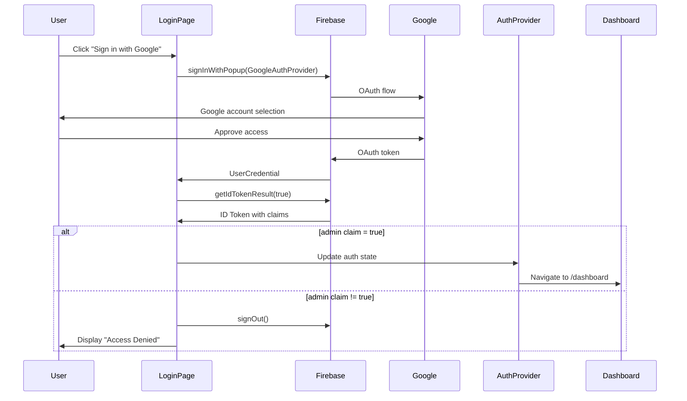
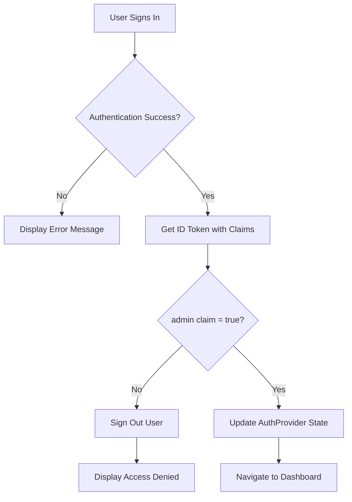

# Design Document: Admin Panel Google Login

## Overview

This design implements Google Sign-In authentication for the HomeFix Admin Panel using Firebase Authentication's Google provider. The solution integrates with the existing Firebase project and authentication infrastructure while maintaining strict admin-only access control through custom claims verification.

The implementation follows a layered architecture:
- **Presentation Layer**: Modern Tailwind UI components for the login interface
- **Authentication Layer**: Firebase Auth with Google OAuth provider
- **Authorization Layer**: Custom claims verification for admin access control
- **State Management Layer**: React Context for centralized auth state

Key design decisions:
- Use Firebase's `signInWithPopup` for Google OAuth (simpler UX than redirect flow)
- Leverage existing `AuthProvider` component for state management
- Extend existing UI components (Button, Input) for consistency
- Force token refresh on sign-in to ensure latest admin claims are checked

## Architecture

### Component Structure

```
apps/admin_panel/src/
├── app/
│   └── login/
│       └── page.tsx                 # Login page with Google sign-in
├── components/
│   ├── AuthProvider.tsx             # Enhanced with Google auth support
│   └── ui/
│       ├── Button.tsx               # Reused for Google sign-in button
│       └── Input.tsx                # Reused for email/password inputs
└── lib/
    ├── firebase.ts                  # Firebase config (already configured)
    └── auth.ts                      # New: Auth utility functions
```

### Authentication Flow



### Authorization Flow



## Components and Interfaces

### 1. Enhanced Login Page Component

**File**: `apps/admin_panel/src/app/login/page.tsx`

**Responsibilities**:
- Render modern login UI with both email/password and Google sign-in options
- Handle Google OAuth sign-in flow
- Verify admin claims after successful authentication
- Display appropriate error messages
- Remove "Tailwind Active" test text

**Key Functions**:

```typescript
// Handle Google sign-in with popup
async function handleGoogleSignIn(): Promise<void>

// Handle email/password sign-in (existing)
async function handleEmailSignIn(email: string, password: string): Promise<void>

// Verify admin claim and handle authorization
async function verifyAdminAccess(user: User): Promise<boolean>
```

**State**:
- `loading: boolean` - Sign-in operation in progress
- `error: string` - Error message to display
- `email: string` - Email input value
- `password: string` - Password input value
- `showPassword: boolean` - Toggle password visibility

### 2. Enhanced AuthProvider Component

**File**: `apps/admin_panel/src/components/AuthProvider.tsx`

**Responsibilities**:
- Monitor Firebase auth state changes
- Verify admin claims on authentication
- Manage global auth state via React Context
- Handle automatic redirects for unauthorized users
- Force token refresh to get latest claims

**Context Interface**:

```typescript
interface AuthContextType {
  user: User | null;           // Firebase user object
  loading: boolean;            // Auth state loading
  isAdmin: boolean;            // Admin claim verification result
  signOut: () => Promise<void>; // Sign out function
}
```

**Key Enhancements**:
- Add `signOut` function to context for easy access
- Improve admin claim verification logic
- Handle edge cases (token refresh failures, network errors)

### 3. Auth Utility Functions

**File**: `apps/admin_panel/src/lib/auth.ts` (new file)

**Purpose**: Centralize authentication logic for reusability

**Functions**:

```typescript
// Sign in with Google using popup
export async function signInWithGoogle(): Promise<UserCredential>

// Verify if user has admin claim
export async function verifyAdminClaim(user: User): Promise<boolean>

// Sign out and clear state
export async function signOutUser(): Promise<void>

// Get fresh ID token with claims
export async function getAdminToken(user: User): Promise<IdTokenResult>
```

### 4. UI Components

**Google Sign-In Button**:
- Extend existing `Button` component
- Add Google logo icon (from lucide-react or custom SVG)
- Use `outline` variant for visual distinction from primary button
- Full width on mobile, auto width on desktop

**Layout**:
- Maintain existing two-column layout (branding left, form right)
- Add Google button above email/password form
- Add "OR" divider between Google and email/password options
- Remove "Tailwind Active" test div

## Data Models

### Firebase User Object

```typescript
interface User {
  uid: string;                    // Unique user ID
  email: string | null;           // User email
  displayName: string | null;     // User display name (from Google)
  photoURL: string | null;        // User profile photo (from Google)
  emailVerified: boolean;         // Email verification status
  // ... other Firebase User properties
}
```

### ID Token Result

```typescript
interface IdTokenResult {
  token: string;                  // JWT token string
  claims: {
    admin?: boolean;              // Custom admin claim
    [key: string]: any;           // Other claims
  };
  expirationTime: string;         // Token expiration
  issuedAtTime: string;           // Token issue time
  signInProvider: string;         // Auth provider used
}
```

### Auth Context State

```typescript
interface AuthState {
  user: User | null;              // Current authenticated user
  loading: boolean;               // Loading state during auth operations
  isAdmin: boolean;               // Whether user has admin privileges
  error: string | null;           // Current error message
}
```

### Google Auth Provider Configuration

```typescript
interface GoogleAuthConfig {
  provider: GoogleAuthProvider;   // Firebase Google provider instance
  customParameters: {
    prompt: 'select_account';     // Force account selection
  };
}
```

## Correctness Properties

*A property is a characteristic or behavior that should hold true across all valid executions of a system—essentially, a formal statement about what the system should do. Properties serve as the bridge between human-readable specifications and machine-verifiable correctness guarantees.*


### Property 1: Admin Claim Authorization

*For any* user who completes Google sign-in, if their ID token contains `admin: true`, they should be granted access to the dashboard; otherwise, they should be signed out and shown an access denied message.

**Validates: Requirements 2.2, 2.3, 2.4, 2.5**

### Property 2: Unauthenticated User Redirect

*For any* navigation attempt to protected routes (non-login pages), if the user is not authenticated, the application should redirect to the login page.

**Validates: Requirements 4.4, 6.5**

### Property 3: Error State Clearing

*For any* error state displayed on the login page, when the user initiates a new sign-in attempt (Google or email/password), the error message should be cleared before the authentication process begins.

**Validates: Requirements 5.5**

### Property 4: Sign-Out State Cleanup

*For any* authenticated user session, when sign-out is triggered, all authentication state (user object, admin status, loading flags) should be cleared and the user should be redirected to the login page.

**Validates: Requirements 6.3**

### Property 5: Authentication Error Handling

*For any* authentication error that occurs during Google sign-in (network errors, popup blocked, user cancellation, Firebase errors), the application should display an appropriate error message without leaving the user in an inconsistent state.

**Validates: Requirements 1.4, 5.1, 5.2, 5.4**

## Error Handling

### Error Categories

**1. Authentication Errors**
- **Network Errors**: Display "Network error. Please check your connection and try again."
- **Popup Blocked**: Display "Popup blocked. Please enable popups for this site and try again."
- **User Cancellation**: Return to login state silently (no error message)
- **Firebase Errors**: Display generic "Authentication failed. Please try again."

**2. Authorization Errors**
- **Missing Admin Claim**: Display "Access Denied: You do not have administrator privileges."
- **Token Refresh Failure**: Sign out user and display "Session error. Please sign in again."

**3. State Management Errors**
- **Context Not Available**: Throw error during development, log error in production
- **Invalid Auth State**: Force sign-out and redirect to login

### Error Handling Strategy

```typescript
// Centralized error handler
function handleAuthError(error: FirebaseError): string {
  switch (error.code) {
    case 'auth/popup-blocked':
      return 'Popup blocked. Please enable popups and try again.';
    case 'auth/popup-closed-by-user':
      return ''; // Silent - user intentionally cancelled
    case 'auth/network-request-failed':
      return 'Network error. Please check your connection.';
    case 'auth/too-many-requests':
      return 'Too many attempts. Please try again later.';
    case 'auth/unauthorized-domain':
      return 'This domain is not authorized. Please contact support.';
    default:
      return 'Authentication failed. Please try again.';
  }
}
```

### Error Recovery

- All errors should be recoverable by retrying the operation
- Error messages should be cleared when user attempts new sign-in
- Failed sign-in attempts should not leave user in authenticated state
- Authorization failures should immediately sign out the user

## Testing Strategy

### Dual Testing Approach

This feature requires both **unit tests** and **property-based tests** for comprehensive coverage:

- **Unit tests**: Verify specific examples, edge cases, and error conditions
- **Property tests**: Verify universal properties across all inputs

Together, these approaches ensure both concrete bug detection and general correctness verification.

### Unit Testing

**Focus Areas**:
- Specific UI element rendering (Google button, email form, error messages)
- Specific error scenarios (popup blocked, network error, user cancellation)
- Component integration (AuthProvider with login page)
- Firebase mock interactions (signInWithPopup, getIdTokenResult)
- Edge cases (missing claims, malformed tokens, expired sessions)

**Example Unit Tests**:
```typescript
describe('Login Page', () => {
  it('should render Google sign-in button', () => {
    // Test that button exists with correct text
  });

  it('should not display "Tailwind Active" text', () => {
    // Test that test text is removed
  });

  it('should display both Google and email/password options', () => {
    // Test that both auth methods are available
  });

  it('should handle popup blocked error', () => {
    // Mock popup blocked error and verify message
  });

  it('should handle user cancellation silently', () => {
    // Mock cancellation and verify no error shown
  });
});

describe('AuthProvider', () => {
  it('should expose user, loading, and isAdmin in context', () => {
    // Test context interface
  });

  it('should call getIdTokenResult with refresh=true', () => {
    // Test token refresh parameter
  });

  it('should not store credentials in localStorage', () => {
    // Verify no sensitive data in storage
  });
});
```

### Property-Based Testing

**Configuration**:
- Use `@fast-check/jest` for TypeScript/JavaScript property-based testing
- Minimum 100 iterations per property test
- Each test must reference its design document property

**Property Test Implementation**:

```typescript
import fc from 'fast-check';

describe('Property Tests: Admin Google Login', () => {
  // Feature: admin-google-login, Property 1: Admin claim authorization
  it('should grant access only to users with admin claim', () => {
    fc.assert(
      fc.property(
        fc.record({
          uid: fc.string(),
          email: fc.emailAddress(),
          claims: fc.record({
            admin: fc.boolean()
          })
        }),
        async (mockUser) => {
          // Test that admin=true grants access, admin=false denies
          const result = await verifyAdminClaim(mockUser);
          expect(result).toBe(mockUser.claims.admin);
        }
      ),
      { numRuns: 100 }
    );
  });

  // Feature: admin-google-login, Property 2: Unauthenticated redirect
  it('should redirect unauthenticated users to login', () => {
    fc.assert(
      fc.property(
        fc.constantFrom('/dashboard', '/users', '/bookings', '/settings'),
        (protectedRoute) => {
          // Test that any protected route redirects when not authenticated
          // Mock unauthenticated state and verify redirect
        }
      ),
      { numRuns: 100 }
    );
  });

  // Feature: admin-google-login, Property 3: Error state clearing
  it('should clear errors on new sign-in attempt', () => {
    fc.assert(
      fc.property(
        fc.string({ minLength: 1 }),
        (errorMessage) => {
          // Test that any error message is cleared on retry
          // Set error state, trigger sign-in, verify cleared
        }
      ),
      { numRuns: 100 }
    );
  });

  // Feature: admin-google-login, Property 4: Sign-out cleanup
  it('should clear all auth state on sign-out', () => {
    fc.assert(
      fc.property(
        fc.record({
          user: fc.object(),
          isAdmin: fc.boolean(),
          loading: fc.boolean()
        }),
        async (authState) => {
          // Test that any auth state is cleared on sign-out
          // Set state, trigger sign-out, verify all cleared
        }
      ),
      { numRuns: 100 }
    );
  });

  // Feature: admin-google-login, Property 5: Error handling
  it('should handle all auth errors gracefully', () => {
    fc.assert(
      fc.property(
        fc.constantFrom(
          'auth/popup-blocked',
          'auth/popup-closed-by-user',
          'auth/network-request-failed',
          'auth/too-many-requests',
          'auth/unauthorized-domain'
        ),
        (errorCode) => {
          // Test that any error code produces appropriate message
          const message = handleAuthError({ code: errorCode });
          expect(typeof message).toBe('string');
          // Verify no error for user cancellation
          if (errorCode === 'auth/popup-closed-by-user') {
            expect(message).toBe('');
          } else {
            expect(message.length).toBeGreaterThan(0);
          }
        }
      ),
      { numRuns: 100 }
    );
  });
});
```

### Integration Testing

**Focus Areas**:
- End-to-end Google sign-in flow (requires Firebase emulator)
- Admin claim verification with real Firebase tokens
- Navigation flow from login to dashboard
- Sign-out flow and redirect behavior

**Testing Tools**:
- Jest for unit and property tests
- React Testing Library for component testing
- Firebase Emulator for integration tests
- fast-check for property-based testing

### Manual Testing Checklist

- [ ] Google sign-in popup opens correctly
- [ ] Admin users can access dashboard
- [ ] Non-admin users see access denied message
- [ ] UI is responsive on mobile, tablet, desktop
- [ ] "Tailwind Active" text is removed
- [ ] Error messages are clear and helpful
- [ ] Sign-out works correctly
- [ ] Page refresh maintains auth state (for admin users)
- [ ] Popup blocker scenario displays helpful message
